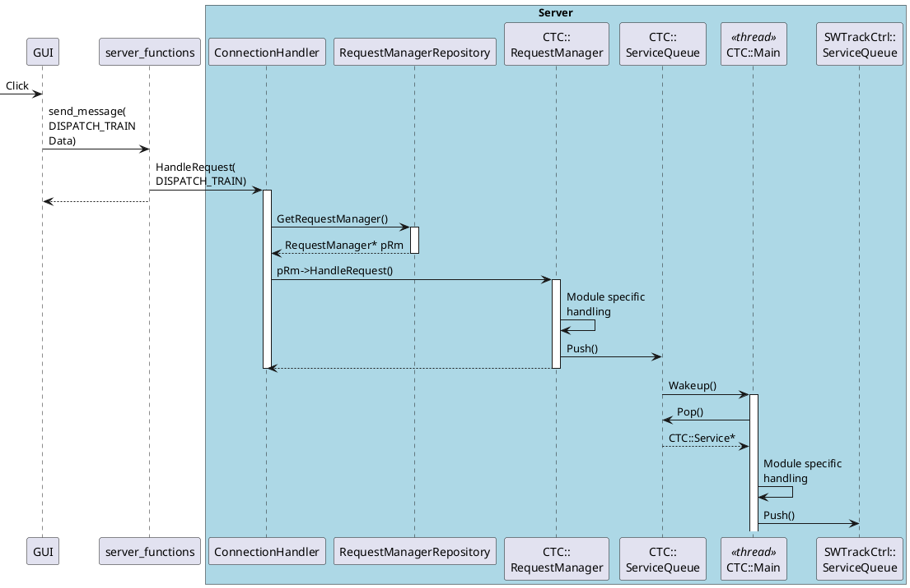
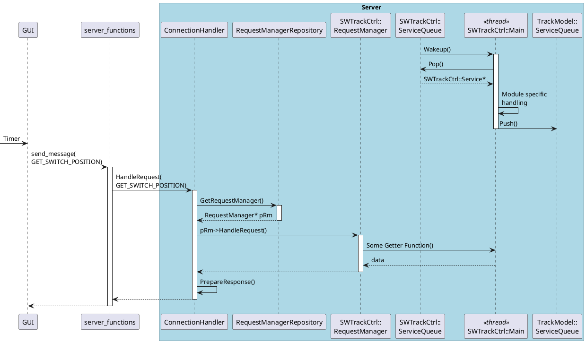

```plantuml
@startuml

participant GUI
participant server_functions as sf
box "Server" #LightBlue
participant ConnectionHandler as ch
participant RequestManagerRepository as rmp
participant "CTC::\nRequestManager" as ctcrm
participant "CTC::\nServiceQueue" as ctcsq
participant "CTC::Main" as main << thread >>
participant "SWTrackCtrl::\nServiceQueue" as swtcsq
end box

[-> GUI : Click
GUI -> sf : send_message(\nDISPATCH_TRAIN\nData)
sf -> ch : HandleRequest(\nDISPATCH_TRAIN)
activate ch
sf --> GUI
ch -> rmp : GetRequestManager()
activate rmp
return RequestManager* pRm
ch -> ctcrm : pRm->HandleRequest()
activate ctcrm
ctcrm -> ctcrm : Module specific\nhandling
ctcrm -> ctcsq : Push()
return
deactivate ch

ctcsq -> main : Wakeup()
activate main
main -> ctcsq : Pop()
ctcsq --> main : CTC::Service*
main -> main : Module specific\nhandling
main -> swtcsq : Push()

@enduml
```

```plantuml
@startuml

participant GUI
participant server_functions as sf
box "Server" #LightBlue
participant ConnectionHandler as ch
participant RequestManagerRepository as rmp
participant "SWTrackCtrl::\nRequestManager" as swtcrm
participant "SWTrackCtrl::\nServiceQueue" as swtcsq
participant "SWTrackCtrl::Main" as main << thread >>
participant "TrackModel::\nServiceQueue" as tmsq
end box

swtcsq -> main : Wakeup()
activate main
main -> swtcsq : Pop()
swtcsq --> main : SWTrackCtrl::Service*
main -> main : Module specific\nhandling
main -> tmsq : Push()
deactivate

[-> GUI : Timer
GUI -> sf : send_message(\nGET_SWITCH_POSITION)
activate sf
sf -> ch : HandleRequest(\nGET_SWITCH_POSITION)
activate ch
ch -> rmp : GetRequestManager()
activate rmp
return RequestManager* pRm
ch -> swtcrm : pRm->HandleRequest()
activate swtcrm
swtcrm -> main : Some Getter Function()
main --> swtcrm : data
return
ch -> ch : PrepareResponse()
return
return

@enduml
```