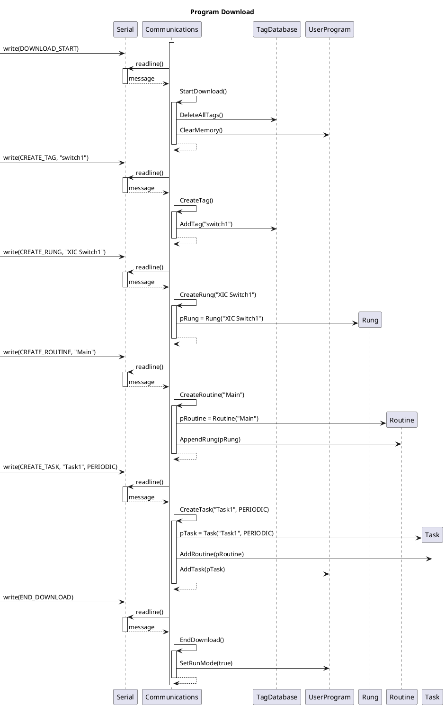
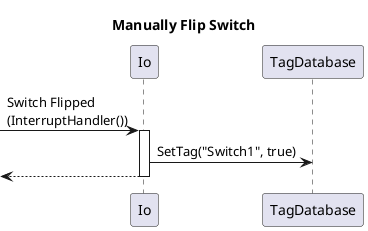
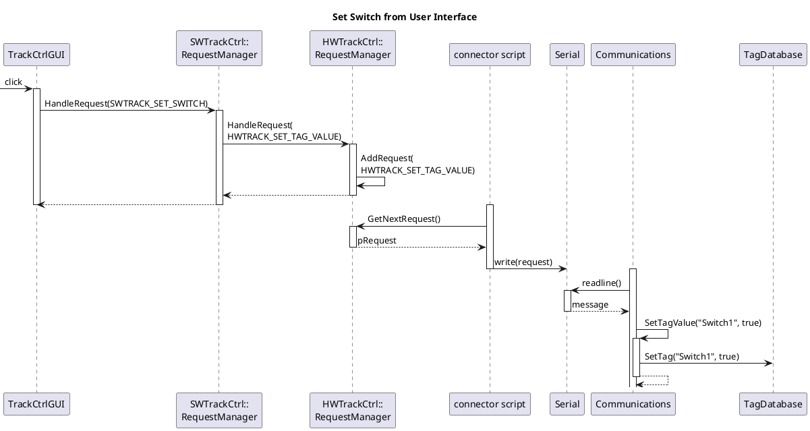

# Class Diagram

```plantuml
@startuml

class HWTrackController::RequestManager
{
    + void HandleRequest(Request&, Response&)
    - void AddRequest(Request&)
    - Request* GetNextRequest()
    - ServiceQueue<Request*> m_requestQueue
}

class Communications << (N,#FFFFFF) Namespace >>
{
    - RequestCode ParseCode(String&)
    - String ParseData(String&)
    - void SendResponse(ResponseCode, char*)
    - void GetTagValue(String&)
    - void SetTagValue(String&)
    - void CreateTag(String&)
    - void StartDownload()
    - void EndDownload()
    - void CreateTask(char*, TaskType)
    - void CreateRoutine(char*)
    - void CreateRung(char*)
    + void CommsTask(void*)
}

class Io << (N, #FFFFFF) Namespace >>
{
    + void SetDisplayText(String&)
    + void SetOutput(int, bool)
    + void IoTask(void*)
    + void InterruptHandler()
}

package "PLC Program"
{

class UserProgram
{
    + void AddTask(Task*)
    + void ClearMemory()
    + bool GetRunMode()
    + void SetRunMode(bool)
    - List<Task*> m_tasks
    - bool m_runMode
    - char* m_pProgramName
}

class Task
{
    {static} + void Run(void*)
    + void Run()
    + void AddRoutine(Routine*)
    - TaskType m_type
    - char* m_pTaskName
    - List<Routine*> m_routineList
}

class Routine
{
    + void Run()
    + void AppendRung(Rung*)
    - char* m_pRoutineName
    - List<Rung*> m_rungList
}

class Rung
{
    + void AddInstruction(Instruction*)
    + void Execute()
    - List<Instruction*> m_instructions
}

class Instruction
{
    + bool Evaluate()
    - InstructionType m_type
    - String m_argument
}

class TagDatabase <<(N,0xFFFFFF) Namespace>>
{
    + void AddTag(char*)
    + bool SetTag(String&, bool)
    + bool GetTagValue(String&, bool&)
    + void DeleteAllTags()
    {static} - HashMap<bool> tags
}

}

Rung *-- "0..*" Instruction : Has
Routine *-- "0..*" Rung : Has
Task *-- "1..*" Routine : Has
UserProgram *-- "0..*" Task : Has

TagDatabase -left- Communications : < Uses
TagDatabase -down- Io : < Uses

TagDatabase - Instruction : < Uses

note bottom of Communications
CommsTask interacts with the serial
port to interface with the software
end note

note right of Io
These functions will interact with
the input/output pins
end note

@enduml
```

# Sequence Diagrams
- Download program
- Programmer manually flips switch
- CTC sends switch position





