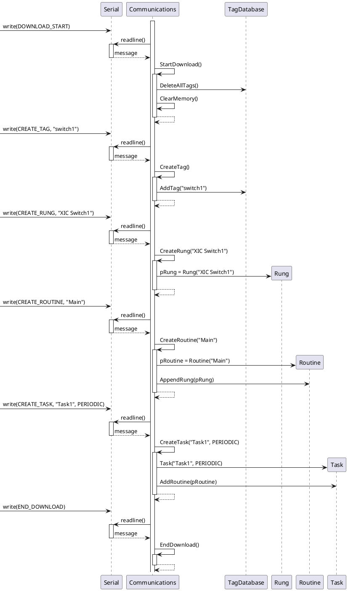
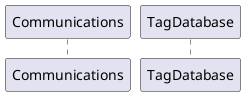

# Class Diagram

```plantuml
@startuml

class Communications << (N,#FFFFFF) Namespace >>
{
    - RequestCode ParseCode(String&)
    - String ParseData(String&)
    - void SendResponse(ResponseCode, char*)
    - void GetTagValue(String&)
    - void SetTagValue(String&)
    - void CreateTag(String&)
    - void StartDownload()
    - void ClearMemory()
    - void EndDownload()
    - void CreateTask(char*, TaskType)
    - void CreateRoutine(char*)
    - void CreateRung(char*)
    + void CommsTask(void*)
}

class Scheduler << Singleton >>
{
    + Scheduler& GetInstance()
    + void AddTask(SystemTask*)
    + void RunTasks()
    - List<SystemTask*> m_taskList
}

class SystemTask
{
    + void Execute()
    + uint32_t GetPeriod()
    + uint64_t GetTimeLastRun()
    + void SetTimeLastRun(uin64_t)
    # uint32_t m_periodInMs
    # uint64_t m_timeLastRunInMs
    # SystemTaskFunction m_taskFunction
    # void* m_pArgument
}

package "User Program"
{

class Task
{
    {static} + void Run(void*)
    + void Run()
    + void AddRoutine(Routine*)
    - TaskType m_type
    - char* m_pTaskName
    - List<Routine*> m_routineList
}

class Routine
{
    + void Run()
    + void AppendRung(Rung*)
    - char* m_pRoutineName
    - List<Rung*> m_rungList
}

class Rung
{
    + void AddInstruction(Instruction*)
    + void Execute()
    - List<Instruction*> m_instructions
}

class Instruction
{
    + bool Evaluate()
    - InstructionType m_type
    - String m_argument
}

class TagDatabase <<(N,0xFFFFFF) Namespace>>
{
    + void AddTag(char*)
    + bool SetTag(String&, bool)
    + bool GetTagValue(String&, bool&)
    + void DeleteAllTags()
    {static} - HashMap<bool> tags
}

}

SystemTask <|-- Task

Rung *-- "0..*" Instruction : Has
Routine *-- "0..*" Rung : Has
Task *-- "1..*" Routine : Has

TagDatabase -up- Communications : < Uses

TagDatabase - Instruction : < Uses

Scheduler - SystemTask : > Schedules
Scheduler - Task : > Schedules

note bottom of Communications
CommsTask interacts with the serial
port to interface with the software
end note

@enduml
```

# Sequence Diagrams
- Download program
- CTC sends switch position
- Programmer manually flips switch



