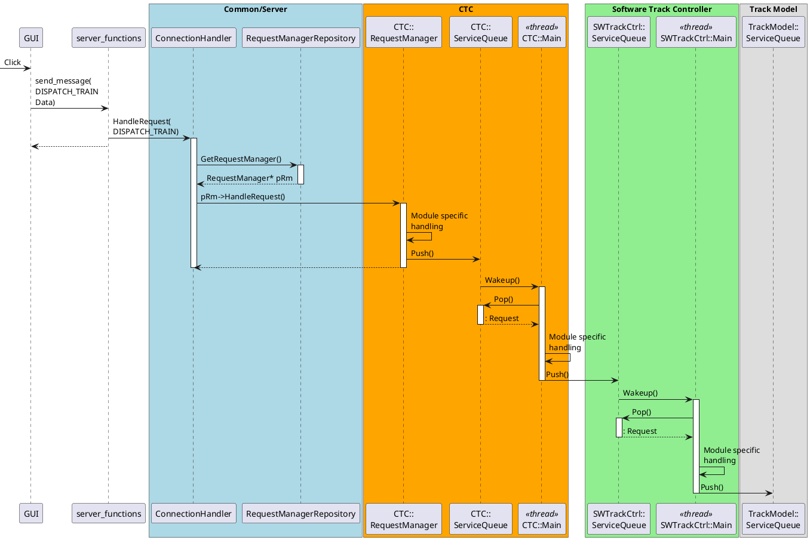
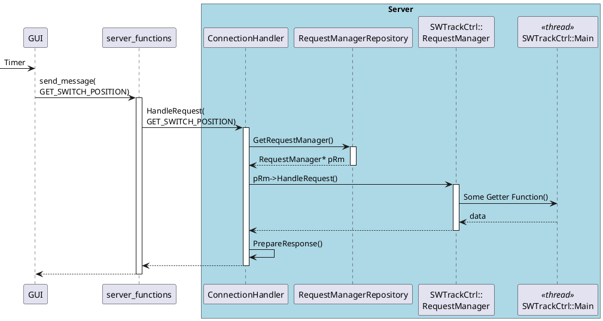
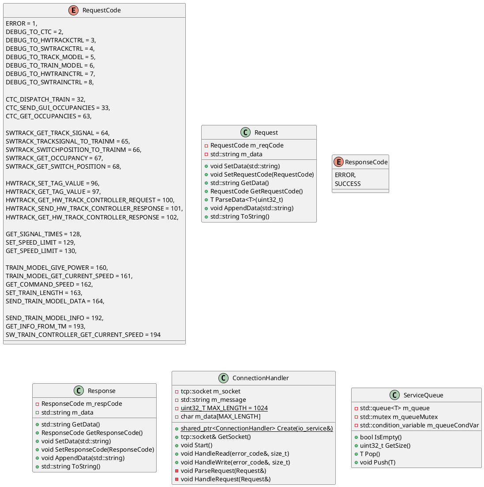

```plantuml
@startuml

participant GUI
participant server_functions as sf
box "Common/Server" #LightBlue
participant ConnectionHandler as ch
participant RequestManagerRepository as rmp
end box
box "CTC" #Orange
participant "CTC::\nRequestManager" as ctcrm
participant "CTC::\nServiceQueue" as ctcsq
participant "CTC::Main" as ctcmain << thread >>
end box
box "Software Track Controller" #LightGreen
participant "SWTrackCtrl::\nServiceQueue" as swtcsq
participant "SWTrackCtrl::Main" as swtcmain << thread >>
end box
box "Track Model"
participant "TrackModel::\nServiceQueue" as tmsq
end box

[-> GUI : Click
GUI -> sf : send_message(\nDISPATCH_TRAIN\nData)
sf -> ch : HandleRequest(\nDISPATCH_TRAIN)
activate ch
sf --> GUI
ch -> rmp : GetRequestManager()
activate rmp
return RequestManager* pRm
ch -> ctcrm : pRm->HandleRequest()
activate ctcrm
ctcrm -> ctcrm : Module specific\nhandling
ctcrm -> ctcsq : Push()
return
deactivate ch

ctcsq -> ctcmain : Wakeup()
activate ctcmain
ctcmain -> ctcsq : Pop()
activate ctcsq
return : Request
ctcmain -> ctcmain : Module specific\nhandling
ctcmain -> swtcsq : Push()
deactivate ctcmain

swtcsq -> swtcmain : Wakeup()
activate swtcmain
swtcmain -> swtcsq : Pop()
activate swtcsq
return : Request
swtcmain -> swtcmain : Module specific\nhandling
swtcmain -> tmsq : Push()
deactivate

@enduml
```

```plantuml
@startuml

participant GUI
participant server_functions as sf
box "Server" #LightBlue
participant ConnectionHandler as ch
participant RequestManagerRepository as rmp
participant "SWTrackCtrl::\nRequestManager" as swtcrm
participant "SWTrackCtrl::Main" as main << thread >>
end box

[-> GUI : Timer
GUI -> sf : send_message(\nGET_SWITCH_POSITION)
activate sf
sf -> ch : HandleRequest(\nGET_SWITCH_POSITION)
activate ch
ch -> rmp : GetRequestManager()
activate rmp
return RequestManager* pRm
ch -> swtcrm : pRm->HandleRequest()
activate swtcrm
swtcrm -> main : Some Getter Function()
main --> swtcrm : data
return
ch -> ch : PrepareResponse()
return
return

@enduml
```

```plantuml
@startuml

enum RequestCode
{
    ERROR = 1,
    DEBUG_TO_CTC = 2,
    DEBUG_TO_HWTRACKCTRL = 3,
    DEBUG_TO_SWTRACKCTRL = 4,
    DEBUG_TO_TRACK_MODEL = 5,
    DEBUG_TO_TRAIN_MODEL = 6,
    DEBUG_TO_HWTRAINCTRL = 7,
    DEBUG_TO_SWTRAINCTRL = 8,

    CTC_DISPATCH_TRAIN = 32,
    CTC_SEND_GUI_OCCUPANCIES = 33,
	CTC_GET_OCCUPANCIES = 63,

    SWTRACK_GET_TRACK_SIGNAL = 64,
    SWTRACK_TRACKSIGNAL_TO_TRAINM = 65,
    SWTRACK_SWITCHPOSITION_TO_TRAINM = 66,
    SWTRACK_GET_OCCUPANCY = 67,
    SWTRACK_GET_SWITCH_POSITION = 68,

    HWTRACK_SET_TAG_VALUE = 96,
    HWTRACK_GET_TAG_VALUE = 97,
    HWTRACK_GET_HW_TRACK_CONTROLLER_REQUEST = 100,
    HWTRACK_SEND_HW_TRACK_CONTROLLER_RESPONSE = 101,
    HWTRACK_GET_HW_TRACK_CONTROLLER_RESPONSE = 102,

    GET_SIGNAL_TIMES = 128,
    SET_SPEED_LIMIT = 129,
    GET_SPEED_LIMIT = 130,

    TRAIN_MODEL_GIVE_POWER = 160,
    TRAIN_MODEL_GET_CURRENT_SPEED = 161,
    GET_COMMAND_SPEED = 162,
    SET_TRAIN_LENGTH = 163,
    SEND_TRAIN_MODEL_DATA = 164,

    SEND_TRAIN_MODEL_INFO = 192,
    GET_INFO_FROM_TM = 193,
    SW_TRAIN_CONTROLLER_GET_CURRENT_SPEED = 194
}

class Request
{
    - RequestCode m_reqCode
    - std::string m_data
    + void SetData(std::string)
    + void SetRequestCode(RequestCode)
    + std::string GetData()
    + RequestCode GetRequestCode()
    + T ParseData<T>(uint32_t)
    + void AppendData(std::string)
    + std::string ToString()
}

enum ResponseCode
{
    ERROR,
    SUCCESS
}

class Response
{
    - ResponseCode m_respCode
    - std::string m_data
    + std::string GetData()
    + ResponseCode GetResponseCode()
    + void SetData(std::string)
    + void SetResponseCode(ResponseCode)
    + void AppendData(std::string)
    + std::string ToString()
}

class ConnectionHandler
{
    - tcp::socket m_socket
    - std::string m_message
    {static} - uint32_T MAX_LENGTH = 1024
    - char m_data[MAX_LENGTH]
    {static} + shared_ptr<ConnectionHandler> Create(io_service&)
    + tcp::socket& GetSocket()
    + void Start()
    + void HandleRead(error_code&, size_t)
    + void HandleWrite(error_code&, size_t) 
    - void ParseRequest(Request&)
    - void HandleRequest(Request&)
}

class ServiceQueue
{
    - std::queue<T> m_queue
    - std::mutex m_queueMutex
    - std::condition_variable m_queueCondVar
    + bool IsEmpty()
    + uint32_t GetSize()
    + T Pop()
    + void Push(T)
}
@enduml
```

```plantuml
@startuml

interface RequestManagerIface <<Interface>>
{
    {abstract} void HandleRequest(Request&, Response&) = 0
}

class CTCRequestManager
{
    void HandleRequest(Request&, Response&)
}

class SWTrackCtrlRequestManager
{
    void HandleRequest(Request&, Response&)
}

class HWTrackCtrlRequestManager
{
    void HandleRequest(Request&, Response&)
}

class TrackModelRequestManager
{
    void HandleRequest(Request&, Response&)
}

class TrainModelRequestManager
{
    void HandleRequest(Request&, Response&)
}

class SWTrainCtrlRequestManager
{
    void HandleRequest(Request&, Response&)
}

class HWTrainCtrlRequestManager
{
    void HandleRequest(Request&, Response&)
}

RequestManagerIface <|-- CTCRequestManager
RequestManagerIface <|-- HWTrackCtrlRequestManager
RequestManagerIface <|-- SWTrackCtrlRequestManager
RequestManagerIface <|-- TrackModelRequestManager
RequestManagerIface <|-- TrainModelRequestManager
RequestManagerIface <|-- HWTrainCtrlRequestManager
RequestManagerIface <|-- SWTrainCtrlRequestManager

class RequestManagerRepository << Singleton >>
{
    - RequestManagerRepository* m_pInstance
    {static} + RequestManagerRepository& GetInstance()
    + RequestManagerIface* GetRequestManager(RequestCode)
}

RequestManagerRepository -down--* CTCRequestManager : > contains
RequestManagerRepository -down--* HWTrackCtrlRequestManager : > contains
RequestManagerRepository -down--* SWTrackCtrlRequestManager : > contains
RequestManagerRepository -down--* TrackModelRequestManager : > contains
RequestManagerRepository -down--* TrainModelRequestManager : > contains
RequestManagerRepository -down--* HWTrainCtrlRequestManager : > contains
RequestManagerRepository -down--* SWTrainCtrlRequestManager : > contains

@enduml
```
